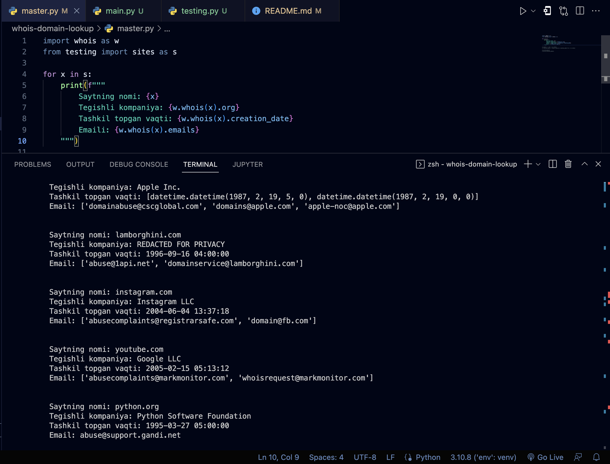

# Pythonda Domen ma'lumotlarini qidiruvchi dastur

## O'rnatish uchun

* pip install -r requirements.txt

## Ishlatish uchun

* python main.py (mac/linux: python3 main.py)

## Kutubxonalar

* python-whois
